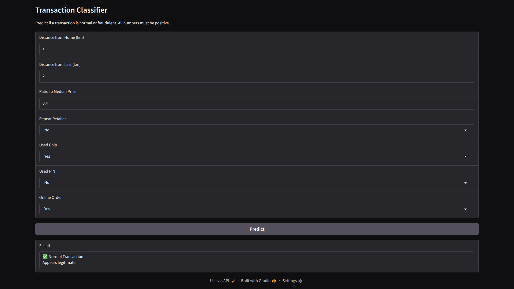

# Credit Card Fraud Detection

This project aims to predict fraudulent use of credit card based on the usage pattern of the credit card,understand the factors contributing to fraudulent activities, and explore effective methods for detection and prevention using *binary classification*.

---
## Problem Statement

- Fraud detection using a credit card usage pattern.
- Handling of highly imbalanced dataset, typically 1% fraud case with 99% legitimate case.
- Maximizing F1 score.
---

## Project Structure


```plaintext
credit_card_fraud_detection/
├── assets/                          # Visualizations, charts, for data
│   └── figures/
│
├── data/                            # Raw and processed data
│   ├── processed_data/
│   │   └── credit_card_fraud_processed_dataset.csv
│   └── raw_data/
│       └── credit_card_fraud_dataset.csv
│
├── src/                       # Step-by-step development notebooks
│   ├── preprocessing.ipynb
│   ├── model_train.ipynb
│   ├── main.py               #code for deploying the model in local system
│   └── clean.py              #code to clean the outputs
│
├── weights/                            
│   ├── models/                         #model weights
│   └── scaler/                         #standard scaler metrics
│
├── reports/                            
│   └── figures/                         #model performance metrics
│
├── logs                             #logs   
│
├── README.md                        # Project documentation
├── LICENSE                          # MIT License
└── requirements.txt                 # Project dependencies
```

---

## Dataset Overview

- **Source**: [Kaggle—Credit Card Fraud Detection](https://www.kaggle.com/datasets/dhanushnarayananr/credit-card-fraud)
- **Total Rows**: one million
- **Columns**:
- `distance_from_home` - the distance from home where the transaction happened.

- `distance_from_last_transaction` - the distance from last transaction happened.

- `ratio_to_median_purchase_price` - Ratio of purchased price transaction to median purchase price.

- `repeat_retailer` - Is the transaction happened from same retailer.

- `used_chip` - Is the transaction through chip (credit card).

- `used_pin_number` - Is the transaction happened by using PIN.

-`online_order` - Is the transaction an online order.

- `fraud` - Is the transaction fraudulent.

---

## Notebook Walkthrough

### preprocessing.ipynb
- Load and inspect the raw dataset
- Identify missing values, data types, and categorical distributions
- Handle nulls, clean categorical values
- Scale the data using standard scaler
- Correlation analysis, target variable distribution
- Determine the imbalance of the dataset
- Save the statistical values required to scale the dataset

### model_train.ipynb
- Create a RandomForestClassifier that can handle imbalance datasets
- Train the model using the dataset above
- Check the performance of the model using, F1 score, precision, recall, roc curve, confusion matrix
- Save the model using joblib


### main.py
- Use gradio to build a web interface for the model and deploy it in a local system
- Load the model and standard scaler metrics
- Get the user inputs from the web interface
- Scale the input and run inferences
- Make it accessible publicly

### clean.py
- Code to clean up the work space.

---

## Key Skills Demonstrated

- Feature Engineering & Encoding
- Data Cleaning & Transformation
- Model Building (Classification & Clustering)
- Model Evaluation & Optimization
- Data Visualization and Insights
- End-to-End Machine Learning Pipeline Structuring

---

## Tools & Libraries Used

- `pandas`, `numpy`, `matplotlib`, `seaborn`
- `scikit-learn`: models, preprocessing, metrics
- `joblib` for model serialization
- `jupyter`, `notebook`
- `gradio` for User Interface

---

## Setup Instructions

```bash
git clone https://github.com/ran-extern/credit_card_fraud_detection
cd credit_card_fraud_detection
pip install -r requirements.txt
```
- Run `preprocessing.ipynb` and `model_train.ipynb` in order.
- Run `main.py` from the project root folder
- It is highly advisable to use python virtual environment
---

## Output Demo

Below is the sample output.

<p align="center">
    
</p>

- **Output**

---

## Author

**Name:** Chabungbam Ranbir Singh  
**Github:** [https://github.com/ran-extern](https://github.com/ran-extern)

---

## License

This project is licensed under the **MIT License**. See the [LICENSE](./LICENSE) file for full details.
